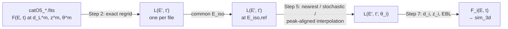
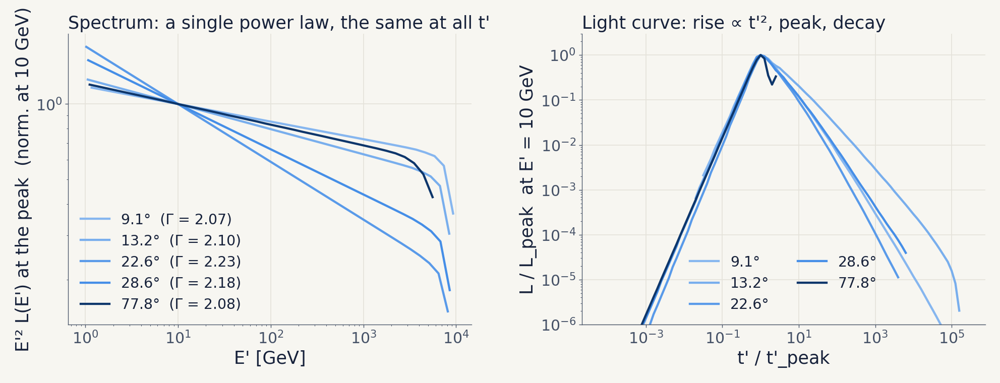
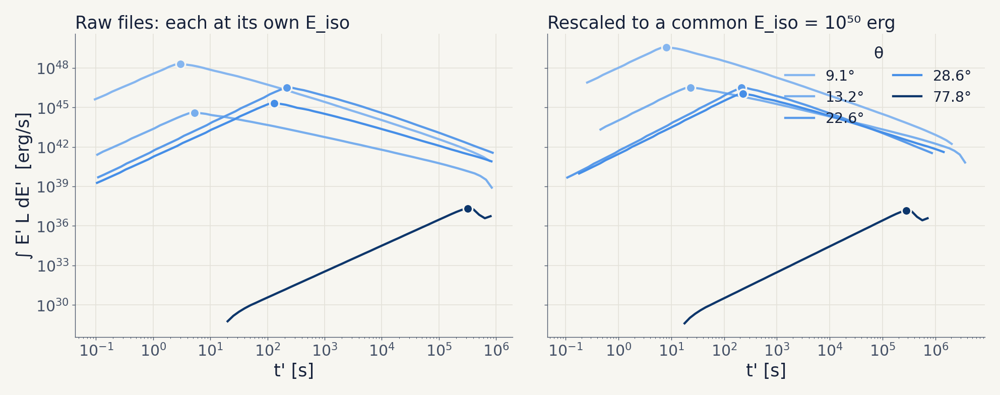
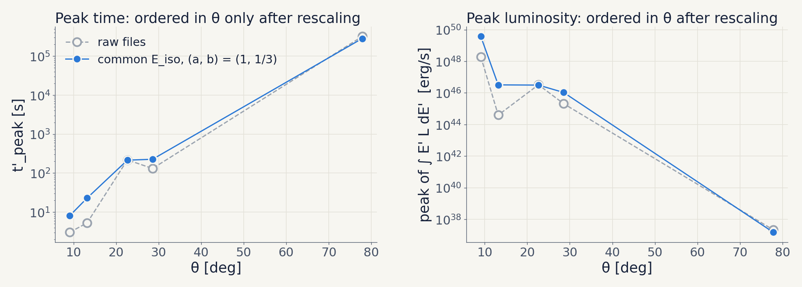
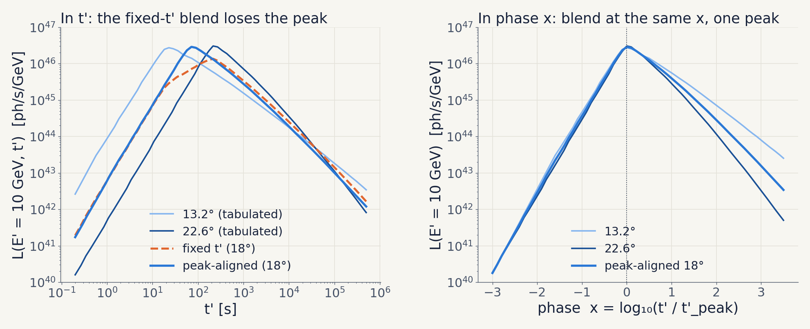
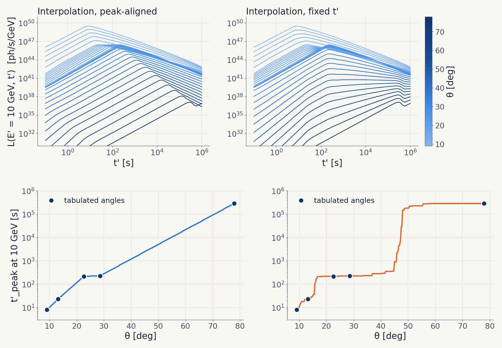
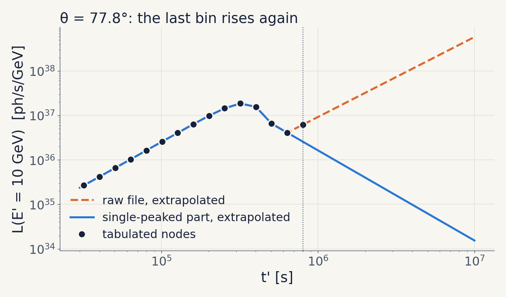

# The emission model in the upper-limit simulation: $L(E', t'; \theta)$

What [`notebooks/setup_model.ipynb`](../notebooks/setup_model.ipynb) computes, the physics
behind each step, and the checks that validate it. The code lives in
[`gwuls/grb_model.py`](../gwuls/grb_model.py). The figures are made from the catalogue files
by [`docs/figures/make_setup_model_figures.py`](figures/make_setup_model_figures.py); rerun it
if the files change. Numbers quoted below are for the five `catO5` files currently in
`data/models/grb_afterglow_inaf/raw/`, as produced by the notebook.

---

## Contents

1. [Where this sits in the pipeline](#1-where-this-sits-in-the-pipeline)
2. [The input: the catO5 catalogue](#2-the-input-the-cato5-catalogue)
3. [The rest frame (Step 2)](#3-the-rest-frame-step-2)
4. [A model at any viewing angle (Step 5)](#4-a-model-at-any-viewing-angle-step-5)
5. [Analytic models (Options 2 and 3)](#5-analytic-models-options-2-and-3)
6. [Output and how `sim_3d` uses it](#6-output-and-how-sim_3d-uses-it)
7. [Caveats and open points](#7-caveats-and-open-points)
8. [References](#8-references)

**Notation.** Unprimed $E, t$ are observer-frame energy and time since the merger; primed
$E', t'$ are rest-frame. $F(E, t)$ is the photon-differential flux
[ph cm⁻² s⁻¹ GeV⁻¹]; $L(E', t')$ is the photon-differential luminosity [ph s⁻¹ GeV⁻¹].
A superscript $m$ marks the values a model file was computed at ($d_L^m$, $z^m$, $\theta^m$);
a subscript $i$ marks the values drawn in Monte-Carlo iteration $i$ ($d_i$, $z_i$,
$\theta_i$). Logarithms are base 10 unless written $\ln$.

---

## 1. Where this sits in the pipeline

In every iteration $i$, the 3D upper limit draws a source (sky position, distance $d_i$,
viewing angle $\theta_i$) and simulates its IACT observation. For that it needs the flux
$F_i(E, t)$ that the emission model predicts for that source. This notebook prepares the one
ingredient that does not depend on the GW alert: the emission model, stored as an intrinsic,
distance-independent, EBL-free rest-frame luminosity that can be evaluated at any angle.



| Guidelines step | What happens | Where |
| --- | --- | --- |
| Step 1: select the emission model | Read every `catO5_*.fits` file (Option 1); build analytic models (Options 2, 3) | `GRBModel.from_inaf_fits`, `.from_analytic`, `.constant_power_law` |
| Step 2: rest-frame $L(E', t')$ | Exact regrid, Eq. (2) | `GRBModel.from_inaf_fits` |
| Step 5: the model at any $\theta$ | Common $E_\mathrm{iso}$, then nearest / stochastic / peak-aligned interpolation | `GRBModelSet.rescaled_to_eiso`, `.get_model` |
| Step 7: back to the observer | Eq. (3), EBL at $z_i$ | `GRBModel.to_observer` (used here for the round-trip check) |

The output is a small cache, one `.npz` per angle, that `sim_3d` loads with one call. It
never parses a FITS file or needs to know how the model was built.

---

## 2. The input: the catO5 catalogue

### 2.1 File contents

The files come from the CTA-GW O5 BNS afterglow catalogue (B. Patricelli). Each one is a
single simulated merger from the O5 population, with its own sky position, distance, viewing
angle and energy. The five files are **five different events**, not one event seen from five
angles.

| HDU | Content | Units |
| --- | --- | --- |
| `PRIMARY` header | `EISO` (prompt $E_\mathrm{iso}$), `DISTANCE`, `ANGLE`, `LONG`, `LAT` | erg, kpc, deg |
| `ENERGIES` | 41 energies, 1 GeV – 10 TeV, log-spaced | GeV (observer frame) |
| `TIMES` | 70 bins $[t_\mathrm{ini}, t_\mathrm{fin}]$, 0.1 s – $10^6$ s, 0.1 dex wide | s (observer frame) |
| `SPECTRA` | $F(E, t)$, intrinsic (no EBL absorption) | ph cm⁻² s⁻¹ GeV⁻¹ |

Each time bin is represented by its geometric centre $t = \sqrt{t_\mathrm{ini}\,t_\mathrm{fin}}$,
the natural centre of a log-spaced bin.

A log-log interpolator needs strictly positive values, so zero cells are removed by dropping
whole energy rows or time columns until the remaining block is all positive
(`_largest_positive_block`). This removes the all-zero 10 TeV row of every file. For the
77.8° file it also removes the 6.3 and 7.9 TeV rows, and the first 23 time bins (before the
off-axis emission starts, observed $t < 20$ s).

### 2.2 The five files

| file | $\theta^m$ | $d_L^m$ [Mpc] | $z^m$ | $E_\mathrm{iso}$ [erg] | grid $n_E \times n_t$ | $t'_\mathrm{pk}$ [s] | $E_\mathrm{rad}/E_\mathrm{iso}$ |
| --- | --- | --- | --- | --- | --- | --- | --- |
| `catO5_301` | 9.1° | 843 | 0.170 | $5.3\times10^{48}$ | 40 × 70 | 3.0 | 7.9 |
| `catO5_26` | 13.2° | 287 | 0.062 | $1.2\times10^{48}$ | 40 × 70 | 5.3 | 0.049 |
| `catO5_1378` | 22.6° | 113 | 0.025 | $1.1\times10^{50}$ | 40 × 70 | 218 | 0.34 |
| `catO5_4` | 28.6° | 349 | 0.075 | $2.0\times10^{49}$ | 40 × 70 | 131 | 0.10 |
| `catO5_2094` | 77.8° | 545 | 0.114 | $1.4\times10^{50}$ | 38 × 47 | $3.2\times10^{5}$ | $4.9\times10^{-8}$ |

$z^m$ is computed from $d_L^m$ with Planck18. $t'_\mathrm{pk}$ is the rest-frame peak of the
energy-integrated light curve $\Lambda(t') = \int E' L\,dE'$ (Section 4.6).
$E_\mathrm{rad} = \iint E' L\,dE'\,dt'$ is the isotropic-equivalent energy radiated over the
tabulated grid (about 1 GeV – 10 TeV).

$E_\mathrm{rad}/E_\mathrm{iso}$ is not monotonic in $\theta$, and the 9.1° file radiates more
in 1 GeV – 10 TeV alone than its header $E_\mathrm{iso}$. The header value is therefore
treated as an event-level energy scale, not as the energy along the line of sight.

### 2.3 What the models look like



- **Spectrum.** At every time, a single power law with photon index $\Gamma = 2.07$–$2.23$,
  constant in time within each file, softening above a few TeV.
- **Light curve.** One peak, at the same time bin at every energy (achromatic, in all five
  files). Rise $\propto t'^{\,1.8\text{–}2.0}$, decay $\propto t'^{\,-0.7}$ to
  $t'^{\,-1.6}$.
- **Separable.** To a good approximation $L(E', t') \approx f(E')\,g(t')$.
- **Peak times** go from 3 s (9.1°) to $3\times10^5$ s (77.8°).

The achromatic peak is what makes the interpolation of Section 4.6 simple: one time shift per
file aligns every energy at once.

---

## 3. The rest frame (Step 2)

### 3.1 From observed flux to rest-frame luminosity

A source at redshift $z$ emits $L(E', t')$ photons per unit rest-frame energy and time.
Photons emitted in $dE'\,dt'$ arrive with $E = E'/(1+z)$ and $t = (1+z)\,t'$, spread over a
sphere of area $4\pi d_M^2$, where $d_M = d_L/(1+z)$ is the transverse comoving distance.
Photon number is conserved, and the Jacobian of $(E', t') \to (E, t)$ is
$(1+z)\cdot(1+z)^{-1} = 1$, so

$$
F(E, t) = \frac{L(E', t')}{4\pi d_M^2}
       = \frac{(1+z)^2}{4\pi d_L^2}\; L\big((1+z)E,\; t/(1+z)\big). \tag{1}
$$

Inverting Eq. (1) at the file's own distance and redshift gives the model in its rest frame:

$$
L(E'_n, t'_n) = \frac{4\pi (d_L^m)^2}{(1+z^m)^2}\, F(E_n, t_n),
\qquad E'_n = (1+z^m)\,E_n, \quad t'_n = \frac{t_n}{1+z^m}. \tag{2}
$$

This is an **exact regrid**: each tabulated node maps to one rest-frame node, and no
interpolation happens at this step. The K-correction is built in, because the model is
always sampled at $(1+z)E$.

The rest frame is the canonical form because it depends on nothing but the source. The file's
own $d_L^m$ and $z^m$ are divided out, and the files carry no EBL absorption (Section 3.4).
One rest-frame model per angle can then be projected to any $(d_i, z_i)$.

### 3.2 Evaluating the model anywhere

`GRBModel.at(E', t')` interpolates $\log L$ bilinearly in $(\log E', \log t')$. Spectra and
light curves are locally power laws, which this interpolation reproduces exactly, and it
avoids the distortion of linear interpolation across a decade-wide cell. Outside the grid,
linear extrapolation in log-log continues the model as a local power law from the edge cell.
`to_observer` warns whenever a query falls outside the tabulated grid.

### 3.3 Back to the observer (Step 7)

For iteration $i$:

$$
F_i(E, t) = \frac{(1+z_i)^2}{4\pi d_i^2}\; L\big((1+z_i)E,\; t/(1+z_i)\big)\; e^{-\tau(E, z_i)}. \tag{3}
$$

EBL absorption $e^{-\tau}$ (Domínguez et al. 2011, via gammapy) is applied only here, at the
drawn $z_i$. It is never applied at the file's own $z^m$, because the files do not contain it.

### 3.4 Checks

- **Round trip.** Eq. (2) followed by Eq. (3) at $(d_L^m, z^m)$, without EBL, must return
  the raw file. Maximum relative error: exactly 0 for all five files.
- **EBL spot-check.** Fit a power law to the 10 lowest energies of one time column,
  extrapolate it, and compare the high-energy deficit with $e^{-\tau(E, z^m)}$. An intrinsic
  file stays near ratio 1 where EBL would already suppress the flux below 0.7. This needs
  `$GAMMAPY_DATA` for the EBL tables and was skipped in the last run (not set).

---

## 4. A model at any viewing angle (Step 5)

### 4.1 Three options

Only five angles are tabulated: 9.1°, 13.2°, 22.6°, 28.6° and 77.8°. For a drawn
$\theta_a < \theta_i < \theta_b$ between two of them, define

$$
w = \frac{\theta_i - \theta_a}{\theta_b - \theta_a} \in (0, 1).
$$

- **A. Nearest.** Use $L_a$ if $w \le 1/2$, else $L_b$.
- **B. Stochastic.** Use $L_b$ with probability $w$, else $L_a$. Over many iterations the
  average model is the linear mixture $(1-w)L_a + wL_b$, and each iteration still uses a real
  file.
- **C. Interpolation.** Build one virtual model at $\theta_i$ (Sections 4.5–4.6).

A $\theta_i$ outside $[9.1°, 77.8°]$ is clipped to the nearest edge file, with a warning.
A $\theta_i$ on a tabulated angle returns that file.

Two things make a naive Option C unfair on these files: they are different events, with
different energies (Sections 4.2–4.4), and their light-curve peaks sit at different times
(Sections 4.5–4.6).

### 4.2 Different events, different $E_\mathrm{iso}$

The header $E_\mathrm{iso}$ spans two decades across the five files
($1.2\times10^{48}$ – $1.4\times10^{50}$ erg). The difference between two neighbouring files
is therefore part angle and part event-to-event scatter. An interpolation in $\theta$ turns
that scatter into an apparent angle dependence. The interpolated model also carries a
meaningless energy: a geometric blend $E_{\mathrm{iso},a}^{1-w} E_{\mathrm{iso},b}^{\,w}$ of
two unrelated events.

The fix is to put every file on one common $E_\mathrm{iso}$ **before** comparing them. That
needs to know how an afterglow changes with the blast-wave energy.

### 4.3 Scale invariance of the blast wave

A relativistic blast wave of energy $E$ in a medium of uniform density $n$ depends on $E$ and
$n$ only through the Sedov length

$$
\ell = \left(\frac{3E}{4\pi n m_p c^2}\right)^{1/3}.
$$

So every dynamical time scale scales as $\ell/c \propto (E/n)^{1/3}$: the deceleration time
$t_\mathrm{dec} \propto (E/n)^{1/3}\,\Gamma_0^{-8/3}$, the off-axis peak, the jet break.
At fixed $n$, the evolution for $E \to kE$ is the same evolution with every time stretched
by $k^{1/3}$.

The flux at the same stage of the evolution (fixed $t\,(E/n)^{-1/3}$) follows from the
standard synchrotron scalings (Sari, Piran & Narayan 1998):

$$
F_{\nu,\max} \propto E\, n^{1/2} \epsilon_B^{1/2}, \qquad
\nu_m \propto E^{1/2} \epsilon_B^{1/2} \epsilon_e^{2}\, t^{-3/2}, \qquad
\nu_c \propto E^{-1/2} n^{-1} \epsilon_B^{-3/2}\, t^{-1/2}.
$$

With $t \propto E^{1/3}$ at fixed stage, $\nu_m$ becomes independent of $E$ and
$\nu_c \propto E^{-2/3}$. Hence

$$
F_\nu \propto
\begin{cases}
F_{\nu,\max}\,(\nu/\nu_m)^{-(p-1)/2} \;\propto\; E & \nu_m < \nu < \nu_c, \\[4pt]
F_{\nu,\max}\,\nu_m^{(p-1)/2}\,\nu_c^{1/2}\,\nu^{-p/2} \;\propto\; E^{2/3} & \nu > \nu_c.
\end{cases}
$$

Changing the energy of a model from $E_\mathrm{iso}$ to $E_\mathrm{iso,ref}$ is therefore

$$
L(E', t') \;\longrightarrow\; k^{a}\, L\!\left(E',\, t'/k^{b}\right),
\qquad k = \frac{E_\mathrm{iso,ref}}{E_\mathrm{iso}},
\qquad b = \tfrac{1}{3},\quad a = 1 \text{ or } \tfrac{2}{3}. \tag{4}
$$

`GRBModel.rescaled_to_eiso(E_ref, L_exponent=a, t_exponent=b)` implements Eq. (4): $L$ is
multiplied by $k^a$ and the time grid by $k^b$. The energy axis is left alone. $\nu_c$ also
moves with $E$, but the catO5 spectra have no break in the band for it to move.

The exponent $b = 1/3$ is hydrodynamics and holds for any emission mechanism. The exponent $a$
depends on the spectral segment. The GeV–TeV emission may also include inverse Compton, for
which these synchrotron exponents are not derived. So $a$ and $b$ are parameters (defaults
`EISO_L_EXPONENT = 1`, `EISO_T_EXPONENT = 1/3`), chosen on the data as follows.

### 4.4 Which exponents: the check on the five files

If the rescaling removes the event-to-event scatter, the peak time should grow and the peak
luminosity should fall with $\theta$. Table: peak time [s] and $\log$ peak luminosity [erg/s]
of $\Lambda(t')$, at $E_\mathrm{iso,ref} = 10^{50}$ erg:

| $\theta$ | raw | $(a, b) = (1, 0)$ | $(2/3, 1/3)$ | $(1, 1/3)$ (default) |
| --- | --- | --- | --- | --- |
| 9.1° | 3.0 s, 48.29 | 3.0 s, 49.57 | 8.1 s, 49.14 | 8.1 s, 49.57 |
| 13.2° | 5.3 s, 44.60 | 5.3 s, 46.51 | 22.9 s, 45.87 | 22.9 s, 46.51 |
| 22.6° | 218 s, 46.51 | 218 s, 46.49 | 215 s, 46.50 | 215 s, 46.49 |
| 28.6° | 131 s, 45.32 | 131 s, 46.03 | 227 s, 45.79 | 227 s, 46.03 |
| 77.8° | $3.2\times10^5$ s, 37.34 | $3.2\times10^5$ s, 37.18 | $2.8\times10^5$ s, 37.23 | $2.8\times10^5$ s, 37.18 |
| **monotonic in $\theta$?** | time no, lum. no | time no, lum. yes | time yes, lum. no | **time yes, lum. yes** |

$(1, 0)$ is a plain $L/E_\mathrm{iso}$ normalisation. Only the default $(1, 1/3)$ orders both
quantities in $\theta$.





This is weak evidence: five points, and only $E_\mathrm{iso}$ is recorded. Whatever else
varies between the events (density, $\epsilon_e$, $\epsilon_B$, jet structure) is still in
the files.

**Rescaling commutes with the interpolation.** In the coordinates
$(u, y) = (\log t', \log L)$, Eq. (4) is a translation $(u, y) \to (u + b\kappa, y + a\kappa)$
with $\kappa = \log k$. The peak-aligned interpolation of Section 4.6 is a convex combination
in these coordinates, so it commutes with the translation: rescaling the set to
$E_\mathrm{iso,ref}$ and then interpolating gives the same model as interpolating the raw
files and rescaling the result from $E_{\mathrm{iso},a}^{1-w} E_{\mathrm{iso},b}^{\,w}$
(checked to $1.7\times10^{-13}$ dex). The rescaling does not change the interpolated shape.
It decides which $E_\mathrm{iso}$ the model at $\theta_i$ carries: the same
$E_\mathrm{iso,ref}$ for every angle, instead of a blend of two unrelated events.

**What reaches the upper limit.** In Step 6 of the guidelines, the drawn model is rescaled to
the trial band luminosity $L_k$ (through $D_i$, `GRBModel.band_integral`). The overall
amplitude of a model, including the factor $k^a$, then cancels. What the upper limit sees is
the **shape**: the spectrum, the light curve, and where its peak falls relative to the
observation window. For the upper limit, the part of Eq. (4) that matters is the time stretch
$k^b$, which is the part fixed by hydrodynamics.

### 4.5 Why interpolating at fixed $t'$ fails

The plain Option C interpolates $\log L$ at the same $(E', t')$:

$$
\log L_\theta(E', t') = (1-w)\,\log L_a(E', t') + w\,\log L_b(E', t'). \tag{5}
$$

That is a geometric mean of the two light curves at the same time, and it misbehaves when the
peaks are far apart. Take two broken power laws with rise index $\alpha_r$ and decay index
$\alpha_d$, peaking at $t'_{\mathrm{pk},a} < t'_{\mathrm{pk},b}$. Before $t'_{\mathrm{pk},a}$
both rise; after $t'_{\mathrm{pk},b}$ both decay; in between, the blend is a power law of index

$$
s = w\,\alpha_{r,b} - (1-w)\,\alpha_{d,a}.
$$

So the blend peaks at $t'_{\mathrm{pk},a}$ while $s < 0$ and jumps to $t'_{\mathrm{pk},b}$
when $s > 0$. The peak time never takes an intermediate value. While the peak sits at
$t'_{\mathrm{pk},a}$, it is $w\,\alpha_r\,\Delta\log t'_\mathrm{pk}$ dex below the
log-interpolated peak, most just before the jump. With rounded peaks and decay slopes that
change along the curve, a second local maximum also appears.

Measured on the five files (common $E_\mathrm{iso}$, $E' = 10$ GeV, 100 angles per bracket):

| bracket | $\Delta \log t'_\mathrm{pk}$ | angles with a double peak | largest peak deficit |
| --- | --- | --- | --- |
| 9.1° – 13.2° | 0.45 | 0 / 100 | 0.16 dex (× 1.4) |
| 13.2° – 22.6° | 0.97 | 16 / 100 | 0.45 dex (× 2.8) |
| 22.6° – 28.6° | 0.02 | 0 / 100 | 0.00 dex |
| 28.6° – 77.8° | 3.10 | 14 / 100 | 2.07 dex (× 120) |

"Peak deficit" is the peak of Eq. (5) below the log-interpolated peak of Section 4.6.

### 4.6 Peak-aligned interpolation

Each file's peak time $t'_{\mathrm{pk},k}$ is the time node where its energy-integrated light
curve $\Lambda_k(t') = \int E' L_k\,dE'$ is largest. Because the peaks are achromatic, this one
time serves every energy. Measure time from the peak, in dex:

$$
x = \log t' - \log t'_{\mathrm{pk},k} \qquad (\text{the phase}).
$$

Interpolate the peak time, and the light curve at fixed phase:

$$
\log t'_\mathrm{pk}(\theta) = (1-w)\,\log t'_{\mathrm{pk},a} + w\,\log t'_{\mathrm{pk},b}, \tag{6}
$$

$$
\log L_\theta(E', x) = (1-w)\,\log L_a(E', x) + w\,\log L_b(E', x),
\qquad L_k(E', x) \equiv L_k\!\left(E',\; t'_{\mathrm{pk},k}\,10^{x}\right), \tag{7}
$$

and place the result at the interpolated peak:
$L(E', t'; \theta) = L_\theta\big(E',\; \log t' - \log t'_\mathrm{pk}(\theta)\big)$.

Properties, all following from Eqs. (6)–(7):

1. **Peak position.** The model peaks at $t'_\mathrm{pk}(\theta)$, which moves continuously
   and log-linearly with $\theta$.
2. **Peak amplitude.** At every energy,
   $\log L_\theta(E', 0) = (1-w)\log L_{a,\mathrm{pk}}(E') + w\log L_{b,\mathrm{pk}}(E')$.
3. **Slopes.** At every phase, the local index
   $s_k(x) = \partial \log L_k / \partial \log t'$ is the same blend,
   $s_\theta(x) = (1-w)\,s_a(x) + w\,s_b(x)$. Rise and decay are interpolated consistently.
4. **One peak.** If both inputs are non-decreasing for $x < 0$ and non-increasing for
   $x > 0$, so is any convex combination of them. The result has exactly one maximum, at
   $x = 0$.
5. **End points.** $w = 0$ and $w = 1$ reproduce the two files exactly. The output grid is the
   union of both inputs' $(\log E', x)$ nodes, and bilinear interpolation on a refinement of a
   bilinear surface is the same surface.
6. **Commutes with Eq. (4)** (Section 4.4).

This is a shift-only registration: the curves are aligned by a translation in $\log t'$. Their
widths in $\log t'$ are not matched, but they are interpolated through property 3. Where one
input's phase range does not cover the other's, it is extrapolated as a power law from its
edge cell. For example, the 77.8° file ends 0.3 dex after its peak, and its decay beyond that
continues as $\approx t'^{\,-2}$.



Left: at 18°, the fixed-$t'$ blend (dashed) is broad and flat-topped, and its peak is a factor
~2 below both files. Right: in phase coordinates the two files have nearly the same rise, and
the peak-aligned model lies between them at every $x$.



Top: light curves at 30 angles from 9.1° to 77.8°. Bottom: peak time against $\theta$.
Peak-aligned (left): one peak per curve, moving log-linearly between the tabulated angles.
Fixed $t'$ (right): the peak time jumps between the tabulated values.

### 4.7 The 77.8° file's last bin



The 77.8° file decays after its peak, then rises again by a factor 1.6 in its last bin
($7.9\times10^5$ – $10^6$ s observed). The bin has the regular width, so the rise is in the
data, not a binning artefact. Extrapolated in log-log, it continues as $t'^{\,+1.7}$
(orange). Under peak alignment, the 77.8° file is evaluated up to 3.4 dex in phase beyond its
last node for every angle in the 28.6°–77.8° bracket, so that rise would dominate their late
light curves.

The interpolation therefore first cuts each input to its single-peaked part: up to the first
local minimum of $\Lambda$ on either side of the peak (`_single_peak_part`). Of the five
files, this removes one node: the last node of the 77.8° file (blue). The raw file itself is
unchanged, and Options A and B still use it as tabulated.

### 4.8 Checks

- **One peak.** 398 angles across the full range × 4 energies (1.5, 10, 100, 1000 GeV) ×
  $t' \in [10^{-2}, 10^{8}]$ s, extrapolation included. Peak-aligned: 0 double-peaked light
  curves. Fixed $t'$: 58, 63, 68, 64.
- **Commutation.** Rescale-then-interpolate against interpolate-then-rescale: maximum
  $|\Delta \log L| = 1.7\times10^{-13}$.
- **End points.** At $w \to 0, 1$ the model matches the tabulated files to $\lesssim 10^{-9}$
  dex (float precision of the stored grids).

---

## 5. Analytic models (Options 2 and 3)

These are built in code, not read from a file, and have no Step 2: the K-correction is
analytic.

- **Option 2**: any separable shape, $L(E', t') = L_0\, \dfrac{f(E')}{f(E_\mathrm{ref})}\, g(t')$.
- **Option 3**: its constant power law, $f = (E'/E_\mathrm{ref})^{-\Gamma}$, $g = 1$.

For $\Gamma = 2$, the observed energy flux in a band $[E_0, E_1]$ has a closed form. Using
Eq. (1):

$$
F_E = \int_{E_0}^{E_1} E\,F\,dE
    = \frac{1}{4\pi d_L^2} \int_{(1+z)E_0}^{(1+z)E_1} E' L(E')\,dE'
    = \frac{L_0 E_\mathrm{ref}^2 \ln(E_1/E_0)}{4\pi d_L^2},
$$

because $E' L(E') = L_0 E_\mathrm{ref}^2 / E'$ integrates to the same logarithm over any band
of the same width in $\ln E'$. The result does not depend on $z$:
$F_E = L_\mathrm{band}/(4\pi d_L^2)$ for every $z_i$. This is the $(1+z)^{\Gamma-2} = 1$
K-correction of [`gwuls/simulate.py`](../gwuls/simulate.py), and the closed-form anchor that
validates the whole chain (Steps 2, 6, 7).

---

## 6. Output and how `sim_3d` uses it

`GRBModelSet.save` writes one file per angle to
`data/models/grb_afterglow_inaf/standardized/`, named `theta_<θ>deg.npz`
(e.g. `theta_022.631deg.npz`):

| key | content |
| --- | --- |
| `theta_deg` | viewing angle |
| `energy_GeV`, `time_s` | rest-frame grids $E'$, $t'$ (after trimming) |
| `L_ph_s_GeV` | $L(E', t')$, shape $(n_E, n_t)$ |
| `D_L_m_Mpc`, `z_m` | the file's own distance and redshift (informational) |
| `E_iso_erg` | the file's $E_\mathrm{iso}$ |
| `meta_json` | origin, source path, trimmed nodes, any rescaling applied |

The cache keeps each file at its own $E_\mathrm{iso}$, so nothing is lost. The common-energy
rescaling is one call after loading, and $E_\mathrm{iso,ref}$ can change without regenerating
the cache.

```python
from gwuls import grb_model, paths

model_set = grb_model.GRBModelSet.load(paths.GRB_MODEL_STANDARDIZED_DIR)  # each file at its own E_iso
model_set = model_set.rescaled_to_eiso(1e50)                               # every angle on one E_iso

# per iteration i, after d_i, z_i and theta_i have been drawn (Step 4):
model_i = model_set.get_model(theta_i, method="interp")      # peak-aligned; or "stochastic", rng=rng
# model_i = model_i.rescaled_to_eiso(E_iso_i)                # optional: draw E_iso per iteration too

# Step 7:
E_obs, t_obs, F_i = model_i.to_observer(d_i, z_i, energy_obs=E_grid, time_obs=t_grid, apply_ebl=True)
```

---

## 7. Caveats and open points

- **Hidden per-event parameters.** Only $E_\mathrm{iso}$ is in the headers. If density,
  $\epsilon_e$, $\epsilon_B$ or the jet structure differ between the five events, those
  differences are still in the files and are read as angle dependence.
- **The amplitude exponent $a$.** It depends on the spectral segment (and on the inverse
  Compton contribution, if any). The default $a = 1$ rests on five points (Section 4.4). With
  the Step 6 normalisation it does not reach the upper limit; $b = 1/3$ does.
- **Weight linear in $\theta$.** Physical dependences on the angle are closer to power laws,
  for which $w$ linear in $\log\theta$ would be the natural choice. For narrow brackets the
  two agree closely. In the 28.6°–77.8° bracket they differ: at 50°, $w$ is 0.44 (linear) or
  0.56 (log), which moves the interpolated peak time by 0.38 dex.
- **Coverage.** No file below 9.1° (near on-axis) or above 77.8°; drawn angles there are
  clipped. The 28.6°–77.8° bracket spans three decades in peak time with no file in between.
  An intermediate file (around 45°–60°) would help every option.
- **The 77.8° last bin** (Section 4.7). Options A and B, and any query of that file beyond
  its grid, still extrapolate the rise. Dropping that bin at load time is a one-line change
  if it is judged an artefact.
- **Extrapolation.** Outside the tabulated $(E', t')$ grid the model continues as a local
  power law. Observation windows should stay within $t' \lesssim 10^6\,\mathrm{s}$ and the
  1 GeV – 10 TeV band of each file.
- **EBL spot-check not run** in the last execution (no `$GAMMAPY_DATA`).
- **Not yet wired into `sim_3d`.** The loader and calls above are ready; the numerical-model
  version of `sim_3d` still has to call them.

---

## 8. References

- R. D. Blandford and C. F. McKee, *Fluid dynamics of relativistic blast waves*, Phys.
  Fluids **19**, 1130 (1976): the self-similar blast wave.
- R. Sari, T. Piran and R. Narayan, *Spectra and light curves of gamma-ray burst
  afterglows*, ApJL **497**, L17 (1998): the synchrotron scalings of Section 4.3.
- H. J. van Eerten and A. I. MacFadyen, *Gamma-ray burst afterglow scaling relations for the
  full blast wave evolution*, ApJL **747**, L30 (2012): scale invariance in $E$ and $n$.
- A. Domínguez et al., *Extragalactic background light inferred from AEGIS galaxy-SED-type
  fractions*, MNRAS **410**, 2556 (2011): the EBL model of Eq. (3).
- Planck Collaboration, *Planck 2018 results. VI. Cosmological parameters*, A&A **641**, A6
  (2020): the cosmology for $z(d_L)$.
- B. Patricelli et al., CTA-GW consortium O5 BNS catalogue: the `catO5_*.fits` files.
