# The GW viewing angle in the upper-limit simulation: $p(d_L, \theta_\mathrm{v})$

What [`notebooks/setup_angle_distribution.ipynb`](../notebooks/setup_angle_distribution.ipynb)
computes, the physics behind each step, and the checks that validate it. The code
lives in [`gwuls/gw_pe.py`](../gwuls/gw_pe.py) (PE files),
[`gwuls/angle_distribution.py`](../gwuls/angle_distribution.py) (the distributions) and
[`gwuls/plotting.py`](../gwuls/plotting.py) (the figures). Numbers quoted below are
for the worked example, **S240615dg** (GW240615_113620, GWTC-5.0), as produced by the
notebook.

> **Note:** S240615dg is a binary black hole ($m_1 \approx 34$, $m_2 \approx 26\,M_\odot$),
> so no jet is expected from it. It is used here because it has a public GWTC-5.0 PE
> release and a sharply measured inclination. For it, the viewing angle is geometry, not a
> prediction about a counterpart. The method is the same for a BNS or an NSBH.

---

## Contents

1. [Where this sits in the pipeline](#1-where-this-sits-in-the-pipeline)
2. [Geometry: from $\theta_{JN}$ to the jet viewing angle](#2-geometry-from-theta_jn-to-the-jet-viewing-angle)
3. [Why distance and angle must be drawn together](#3-why-distance-and-angle-must-be-drawn-together)
4. [Joint, conditionals and marginals](#4-joint-conditionals-and-marginals)
5. [PE data: raw release to a light per-alert file](#5-pe-data-raw-release-to-a-light-per-alert-file)
6. [Estimating the joint from samples](#6-estimating-the-joint-from-samples)
7. [Results for S240615dg](#7-results-for-s240615dg)
8. [The alert skymap and the PE disagree on distance](#8-the-alert-skymap-and-the-pe-disagree-on-distance)
9. [Without PE: population and placeholder options](#9-without-pe-population-and-placeholder-options)
10. [Where the choice reaches the upper limit](#10-where-the-choice-reaches-the-upper-limit)
11. [How `sim_3d` uses the result](#11-how-sim_3d-uses-the-result)
12. [Caveats and open points](#12-caveats-and-open-points)
13. [References](#13-references)

---

## 1. Where this sits in the pipeline

The simulation marginalises the upper limit over the GW source parameters. In every
iteration $i$ it draws one possible source and simulates its IACT observation
(Step 4 of the simulation guidelines):

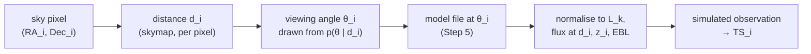

The angle only enters through the **shape** of the emission model. The model is rescaled to
the trial luminosity $L_k$, but a larger viewing angle delays the light-curve peak and softens
the spectrum. With the INAF catalogue this means **choosing which model file** to use (at
9.1°, 13.2°, 22.6°, 28.6° or 77.8°). The angle distribution therefore decides which light
curves the upper limit is built from.

The notebook answers one question per alert: *what is $p(\theta_\mathrm{v} \mid d)$ for this
alert, given whatever LVK has released?* It writes the answer to
`data/gw_input/<alert>_theta_distribution.npz`. `sim_3d` loads that file with one call and
never needs to know which case produced it.

---

## 2. Geometry: from $\theta_{JN}$ to the jet viewing angle

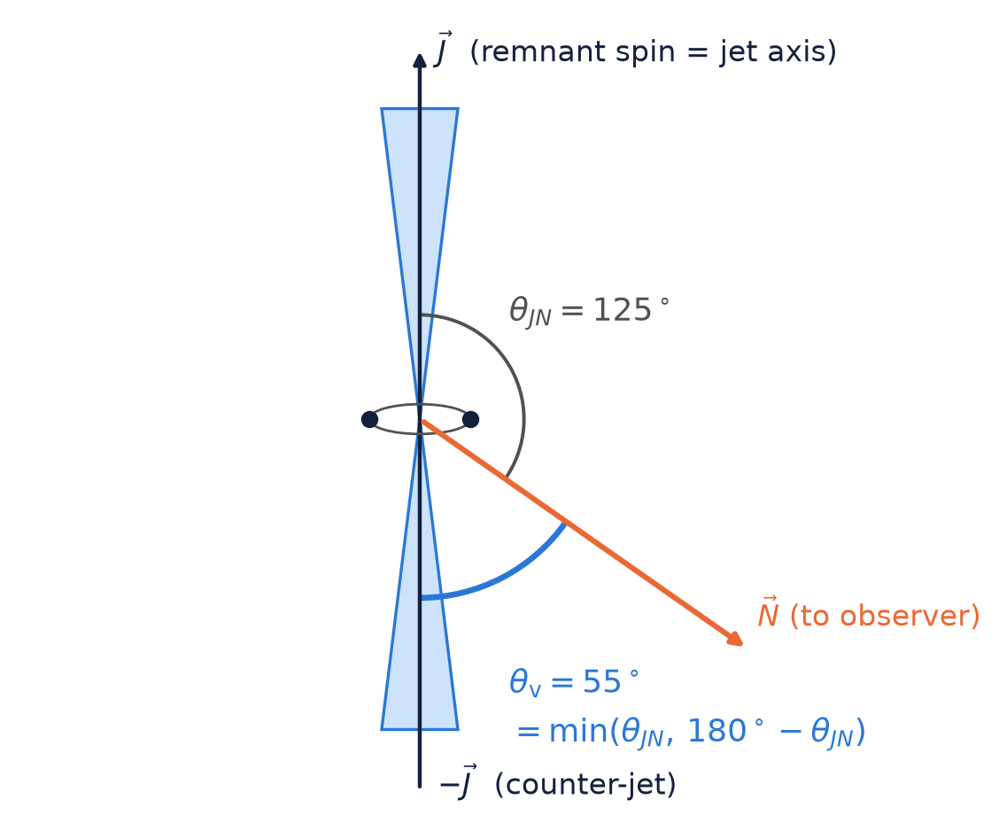

GW parameter estimation reports two inclination angles, both measured from the line of
sight $\vec N$ (source to observer), in $[0^\circ, 180^\circ]$:

| angle | measured between $\vec N$ and | notes |
| --- | --- | --- |
| $\theta_{JN}$ | the **total** angular momentum $\vec J$ | fixed in direction even for a precessing binary |
| $\iota$ | the **orbital** angular momentum $\vec L$ at $f_\mathrm{ref}$ | precesses around $\vec J$; depends on the reference frequency |

A jet is launched along the spin axis of the remnant, which is essentially $\vec J$, so
**$\theta_{JN}$ is the right angle, not $\iota$**. The jet is also bipolar: $\theta_{JN}$ and
$180^\circ - \theta_{JN}$ put the observer at the same angle from *a* jet. The quantity
that matters for an EM counterpart is therefore the angle to the **nearer** jet axis:

$$
\theta_\mathrm{v} = \min\left(\theta_{JN},\ 180^\circ - \theta_{JN}\right) \in [0^\circ, 90^\circ].
$$

This fold also removes the face-on/face-off degeneracy of GW data, which is irrelevant for a
bipolar jet. The fold used here matches the `viewing_angle` column that pesummary writes into
the PE files to $4\times10^{-15}$ deg (checked in Part 0 of the notebook).

With no information at all, orientations are isotropic: $\cos\theta_{JN}$ is uniform on
$[-1, 1]$, and so $\cos\theta_\mathrm{v}$ is uniform on $[0, 1]$:

$$
p_\mathrm{iso}(\theta_\mathrm{v})\,d\theta_\mathrm{v} = \sin\theta_\mathrm{v}\,d\theta_\mathrm{v}
\quad\Longrightarrow\quad
p_\mathrm{iso}(\theta_\mathrm{v}) = \frac{\pi}{180}\,\sin\theta_\mathrm{v}\ \ [\mathrm{deg}^{-1}],
$$

which vanishes at $\theta_\mathrm{v} = 0$: small viewing angles occupy little solid angle.
**Every pdf in this document and in the code is normalised per degree**, so all options can
be compared on one axis.

---

## 3. Why distance and angle must be drawn together

For a quasi-circular inspiral, the two GW polarisations at the detector are, to leading
(quadrupole) order,

$$
h_+ = \frac{\mathcal{A}}{d_L}\,\frac{1 + \cos^2\iota}{2}\,\cos\Phi(t),
\qquad
h_\times = \frac{\mathcal{A}}{d_L}\,\cos\iota\,\sin\Phi(t),
$$

with $\mathcal{A}$ set by the (redshifted) chirp mass and frequency. The detector sees
$h = F_+ h_+ + F_\times h_\times$, with antenna patterns $F_{+,\times}$ that depend on sky
position and polarisation angle. The matched-filter SNR is then (Finn & Chernoff 1993)

$$
\rho = \rho_\mathrm{th}\,\frac{D_h}{d_L}\,\frac{\Theta}{4},
\qquad
\Theta = 2\sqrt{F_+^2\,(1 + \cos^2\iota)^2 + 4F_\times^2\cos^2\iota}\ \in [0, 4],
$$

where $D_h$ is the **horizon**: the distance at which an optimally located, face-on source
($\Theta = 4$) reaches the threshold $\rho_\mathrm{th}$.

The measured amplitude constrains mostly the combination $\Theta(\iota)/d_L$. A **face-on
source far away and a more inclined source nearby produce nearly the same signal**. This is
the distance–inclination degeneracy, and it is why the angle drawn in an iteration must
depend on that iteration's distance. For S240615dg the posterior correlation between $d_L$
and $\cos\theta_\mathrm{v}$ is **0.82**.

---

## 4. Joint, conditionals and marginals

The central object is the joint density $p(d, \theta)$ (writing $d \equiv d_L$ and
$\theta \equiv \theta_\mathrm{v}$). The guidelines phrase Step 4.3 as "marginalise over
$d_i$". The operation actually needed per iteration is **conditioning**:

$$
p(\theta \mid d) = \frac{p(d, \theta)}{p(d)},
\qquad
p(d) = \int_0^{90^\circ} p(d, \theta)\,d\theta .
$$

The same joint answers three other questions:

| question | operation | method |
| --- | --- | --- |
| $\theta_i$ once $d_i$ is drawn (every `sim_3d` iteration) | $p(\theta \mid d_i)$ | `ThetaDistribution.sample(n, distance_Mpc=d)` |
| distance when the angle is known exactly | $p(d \mid \theta_0) = p(d, \theta_0)\,/\,p(\theta_0)$ | `joint.conditional_distance(theta_deg=θ0)` |
| distance when the angle is known within a range | $p(d \mid a < \theta < b) \propto \int_a^b p(d, \theta)\,d\theta$ | `joint.conditional_distance(theta_range=(a, b))` |
| one variable regardless of the other | $p(d)$, $\;p(\theta) = \int p(d, \theta)\,dd$ | `joint.marginal_distance()`, `joint.marginal_theta()` |
| (RA, Dec, $d$, $\theta$) together | resample PE sample indices | `ThetaDistribution.sample_joint(n)` |

Which joint is available depends on what LVK has released for the alert:

| information available | `kind` | $\theta$ depends on $d$? | section |
| --- | --- | --- | --- |
| PE posterior samples (GWTC data release) | `"pe"` | yes, from the event's own posterior | [5](#5-pe-data-raw-release-to-a-light-per-alert-file)–[8](#8-the-alert-skymap-and-the-pe-disagree-on-distance) |
| nothing event-specific; detected population with a horizon | `"selection"` | yes, near $D_h$ only face-on sources are detected | [9](#9-without-pe-population-and-placeholder-options) |
| Schutz (2011) detected-source distribution | `"schutz"` | no | [9](#9-without-pe-population-and-placeholder-options) |
| geometric isotropic prior | `"isotropic"` | no | [9](#9-without-pe-population-and-placeholder-options) |
| angle fixed by assumption, or a dummy split | `"fixed"`, `"two_bin"` | no | [9](#9-without-pe-population-and-placeholder-options) |

---

## 5. PE data: raw release to a light per-alert file

### 5.1 The raw release

A GWTC PE data release (`*-combined_PEDataRelease.hdf5`, from Zenodo) holds, per event,
several **waveform analyses**. For GWTC-5.0 these are IMRPhenomXPHM-SpinTaylor,
IMRPhenomXPNR, NRSur7dq4 and SEOBNRv5PHM. Each has ~12–16k posterior samples of ~180
parameters, plus PSDs, calibration envelopes, priors, configuration and a skymap. The file
for S240615dg is **6.6 GB**. These raw files live in `data/gw_pe/raw/` (gitignored), next
to the catalog's `*-PESummaryTable.hdf5`, which maps GWTC names to superevent IDs.

The samples are draws from the posterior

$$
p_k(\vec\vartheta \mid \mathrm{data}) \propto \mathcal{L}_k(\mathrm{data} \mid \vec\vartheta)\,\pi(\vec\vartheta),
$$

with the analysis-$k$ likelihood and the standard priors. For the two parameters used here,
the priors are `UniformSourceFrame` for $d_L$ (uniform in comoving volume and source-frame
time, 10–10 000 Mpc, Planck15) and `Sine` for $\theta_{JN}$, i.e. isotropic. The posterior,
prior included, is what the simulation should draw from, so nothing is reweighted.

### 5.2 Equal-weight mixture

LVK catalog papers combine waveform analyses with equal weight, so that waveform
systematics are folded into the result:

$$
p_\mathrm{mix}(d, \theta) = \frac{1}{K}\sum_{k=1}^{K} p_k(d, \theta \mid \mathrm{data}).
$$

Drawing the **same number** $n$ of samples from each analysis and concatenating them gives
samples of $p_\mathrm{mix}$ directly. That is how the light file is built, with
$n = 5000$ per analysis by default (capped at the smallest analysis).

### 5.3 The standardized file

`gw_pe.standardize_pe_release` (or `standardize_all` for every raw file present) writes
`data/gw_pe/standardized/<superevent>.h5`, about **0.85 MB** and **tracked in git**:

| group | content |
| --- | --- |
| attributes | superevent ID, GW name, catalog, source file, analyses, $n$ per analysis, seed, trigger GPS time, creation time, git revision |
| `posterior/` | `ra`, `dec`, `luminosity_distance`, `redshift`, `theta_jn`, `iota`, `mass_1_source`, `mass_2_source`, `chirp_mass_source`, `chi_eff`, `lambda_1`/`lambda_2` (when present), `network_matched_filter_snr` (float32, radians); `analysis` (which analysis each sample came from) |
| `prior/` | PE prior samples of `luminosity_distance` and `theta_jn`, per analysis |
| `analyses/<name>` | approximant, $f_\mathrm{ref}$, cosmology, detectors, sample counts, the prior definitions of $d_L$ and $\theta_{JN}$ |

A column is kept only if every analysis has it, so the mixture is the same set of samples
for every column. Files are named by the **superevent ID** (the name the alert went out
under, and the name of its skymap in `data/gw_input/`), not the GWTC name.
`data/gw_pe/standardized/index.csv` is regenerated from the files every time. It has one row
per alert, so it is a running record of the alerts whose PE has been released:

| alert | GW name | $d_L$ [Mpc] (median, 90%) | $\theta_\mathrm{v}$ [deg] (median, 90%) | $P(\theta_\mathrm{v} < 30^\circ)$ | $m_1, m_2$ [$M_\odot$] |
| --- | --- | --- | --- | --- | --- |
| S240615dg | GW240615_113620 | 1566 [1123, 1849] | 24.4 [6.5, 51.1] | 0.647 | 34.1, 26.0 |
| S241125n | GW241125_010116 | 4748 [2600, 8611] | 55.8 [15.6, 86.0] | 0.168 | 59.3, 46.1 |

Because these files are small and tracked, the notebook runs where the raw files are absent
(e.g. the cluster). Part 0 then just reads the tracked files.

### 5.4 Check: the light file loses nothing

Stored subset (5000 samples) against the full raw posterior, per analysis:

| analysis | $n$ full | $\theta_\mathrm{v}$ q5/50/95: full → kept | $d_L$ q5/50/95: full → kept |
| --- | --- | --- | --- |
| IMRPhenomXPHM-SpinTaylor | 14327 | 6.4/24.2/52.1 → 6.2/24.3/52.3 | 1114/1565/1859 → 1120/1565/1865 |
| IMRPhenomXPNR | 12522 | 6.6/23.4/46.9 → 6.5/23.6/47.0 | 1206/1580/1851 → 1203/1577/1849 |
| NRSur7dq4 | 15884 | 7.1/25.8/51.4 → 6.9/25.4/51.7 | 1095/1570/1867 → 1080/1572/1866 |
| SEOBNRv5PHM | 15742 | 6.6/24.6/52.3 → 6.5/24.3/53.2 | 1110/1552/1809 → 1101/1554/1811 |

The differences are subsampling noise: at most about 1° in the tails and about 15 Mpc.

---

## 6. Estimating the joint from samples

The samples define $p(d, \theta)$ only implicitly. `sim_3d` needs to evaluate the
conditional at *any* $d_i$, so the notebook builds a smooth density on a grid:
`JointDistanceAngle.from_samples`, a Gaussian kernel density estimate (KDE).

### 6.1 Variables: $(d, \cos\theta_\mathrm{v})$, not $(d, \theta_\mathrm{v})$

Any smooth orientation posterior has density per unit solid angle that is finite at the pole.
Per **degree**, it therefore vanishes linearly at $\theta_\mathrm{v} = 0$ (the $\sin\theta$
factor). A KDE done directly in $\theta_\mathrm{v}$ would smear mass onto $\theta = 0$. In
$c = \cos\theta_\mathrm{v} \in [0, 1]$ the density is finite and smooth at both edges. The
KDE is done there and mapped back with the Jacobian:

$$
p(d, \theta_\mathrm{v}) = \hat f(d, \cos\theta_\mathrm{v})\,\sin\theta_\mathrm{v}\,\frac{\pi}{180}
\qquad [\mathrm{Mpc}^{-1}\,\mathrm{deg}^{-1}].
$$

### 6.2 Kernel: full covariance (Scott's rule)

With weights $w_k$ (here equal), $n_\mathrm{eff} = 1/\sum_k w_k^2$, and $\hat\Sigma$ the
sample covariance of $\mathbf{x}_k = (d_k, c_k)$, the kernel covariance is Scott's rule in
two dimensions, times a user factor $b$ (`BW_SCALE`):

$$
H = b^2\,n_\mathrm{eff}^{-1/3}\,\hat\Sigma .
$$

Because $H$ carries the samples' correlation, the kernel is **tilted along the degeneracy**
instead of blurring across it. For S240615dg: $\sigma_d = 42$ Mpc,
$\sigma_c = 0.023$, and kernel correlation 0.82.

### 6.3 Boundaries: exact reflection

The support is bounded at $c = 0$ ($\theta_\mathrm{v} = 90^\circ$, where the fold makes the
density symmetric), at $c = 1$ ($\theta_\mathrm{v} = 0$), and at $d = 0$ if the grid reaches
it. With $R$ the reflection about a boundary, the estimator is

$$
\hat f(\mathbf{x}) = \sum_k w_k\left[K_H(\mathbf{x} - \mathbf{x}_k) + K_{RHR}(\mathbf{x} - R\,\mathbf{x}_k)\right].
$$

A mirrored sample is smoothed with the **mirrored kernel** $RHR$, which has the $d$–$c$
correlation flipped. That is what makes it an exact reflection: the mass a tilted kernel
pushes past an edge comes back with the right tilt. Mirroring the samples but keeping $H$
would bias the density near the edges when the correlation is strong. For S240615dg, fixing
this moved the grid's median distance from 1561 to 1565 Mpc (samples: 1566). It also brought
the conditional median at the 95th-percentile distance onto the grid-free value (13.6°).

### 6.4 Grid, normalisation, support

The samples are binned on a $300 \times 400$ lattice in $(d, c)$, and each part is convolved
with its kernel by FFT. The result is interpolated to 181 angles (0.5° steps) and normalised
so that $\iint p\,dd\,d\theta = 1$. 20 000 samples take about 0.4 s. The **distance support**
is where $p(d)$ exceeds $10^{-6}$ of its peak ([380, 2352] Mpc for S240615dg). A requested
$d$ outside it is clamped to the nearest edge, and `sample` warns with the number of clamped
draws.

### 6.5 Conditionals and sampling on the grid

For an arbitrary $d$ between grid rows $d_j \le d < d_{j+1}$, the joint is interpolated
linearly and renormalised:

$$
p(\theta \mid d) \propto (1 - w)\,p(d_j, \theta) + w\,p(d_{j+1}, \theta),
\qquad w = \frac{d - d_j}{d_{j+1} - d_j}.
$$

$\theta$ is then drawn by inverse CDF on the cumulative trapezoid integral. This is
vectorised: 100 000 conditional draws, each at its own $d_i$, take about 0.1 s.
$p(d \mid \theta_0)$ and $p(d \mid a < \theta < b)$ are the matching column slices and
column integrals.

---

## 7. Results for S240615dg

### 7.1 The joint posterior

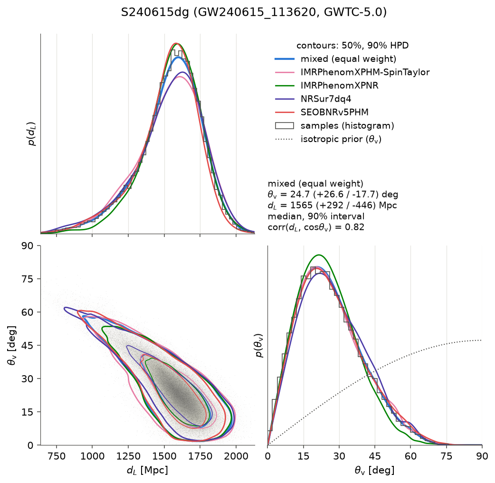

The gray fill and blue contours show the mixed joint, with 50% and 90% highest-density
regions. The coloured contours are each waveform analysis on its own, and the faint dots and
gray histograms are the samples. The dotted line is the isotropic PE prior. The four
analyses agree closely, so mixing them costs nothing:

| analysis | $\theta_\mathrm{v}$ median [90%] | $d_L$ median [90%] (Mpc) | $P(\theta_\mathrm{v} < 30^\circ)$ |
| --- | --- | --- | --- |
| **mixed (equal weight)** | **24.7 [7.0, 51.3]** | **1565 [1120, 1858]** | **0.641** |
| IMRPhenomXPHM-SpinTaylor | 24.7 [7.0, 52.4] | 1563 [1107, 1878] | 0.640 |
| IMRPhenomXPNR | 23.9 [6.9, 47.3] | 1576 [1197, 1859] | 0.676 |
| NRSur7dq4 | 25.9 [7.4, 52.2] | 1568 [1074, 1880] | 0.606 |
| SEOBNRv5PHM | 25.0 [7.1, 53.3] | 1553 [1096, 1826] | 0.630 |

The GW data move the angle far from the isotropic prior (median 60°): the posterior median
is 25°, and 64% of the probability lies within 30° of the jet axis.

### 7.2 $p(\theta_\mathrm{v} \mid d)$ along $d$

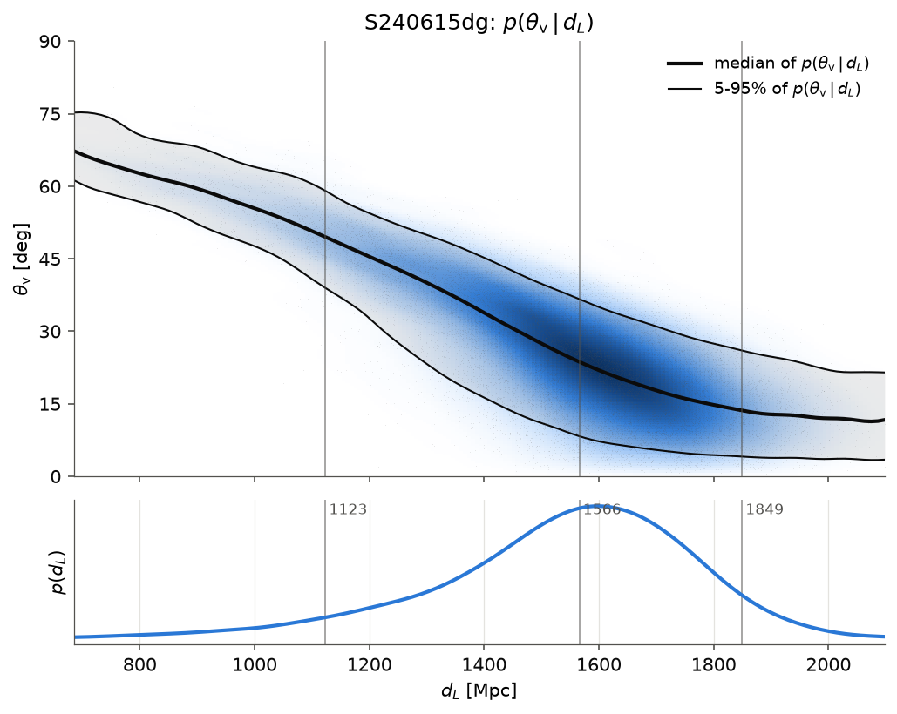

The median of the conditional falls from **49.5° at 1123 Mpc** (5th percentile of $p(d)$)
to **13.6° at 1849 Mpc** (95th percentile). An iteration that draws a nearby distance must
draw an inclined source, and one that draws a far distance must draw a nearly face-on
source. Drawing $\theta$ from the marginal instead would pair far distances with inclined
angles, combinations the GW data exclude.

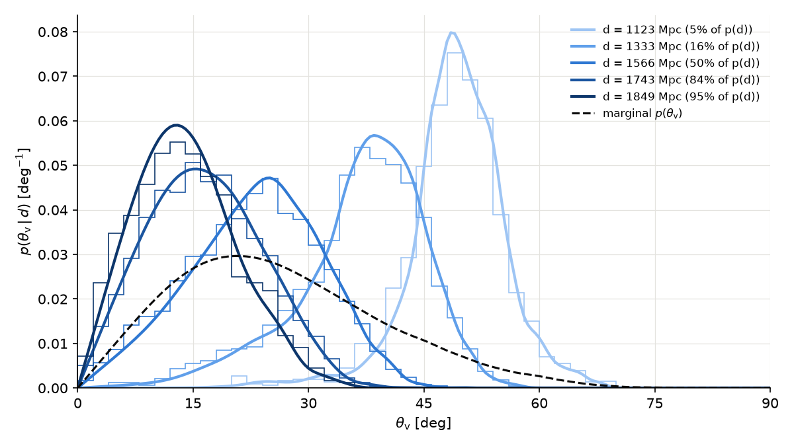

**Check: grid against a grid-free estimate.** The grid conditional is compared with
`conditional_theta_by_resampling`, which resamples the raw samples with Gaussian weights
$\exp[-(d_k - d)^2 / 2h^2]$ ($h$ = 10% of the 16–84% width of $p(d)$), with no KDE and no
grid:

| $d$ (Mpc) | percentile of $p(d)$ | grid: median [90%] | resampling: median [90%] |
| --- | --- | --- | --- |
| 1123 | 5% | 49.5 [38.9, 59.0] | 49.3 [37.4, 59.4] |
| 1333 | 16% | 38.1 [20.6, 48.5] | 37.8 [19.4, 48.6] |
| 1566 | 50% | 23.7 [8.3, 36.6] | 23.3 [7.5, 36.7] |
| 1743 | 84% | 16.3 [4.9, 29.3] | 16.2 [4.5, 29.5] |
| 1849 | 95% | 13.6 [4.1, 26.0] | 13.6 [3.7, 26.4] |

**Check: bandwidth.** Halving or doubling $b$ moves the conditional medians by at most 1.5°,
much less than their 90% widths (about 20–30°):

| $d$ (Mpc) | $b = 0.5$ | $b = 1$ | $b = 2$ |
| --- | --- | --- | --- |
| 1123 | 49.5 | 49.5 | 49.1 |
| 1333 | 38.2 | 38.1 | 37.7 |
| 1566 | 23.5 | 23.7 | 24.5 |
| 1743 | 16.0 | 16.3 | 17.1 |
| 1849 | 13.2 | 13.6 | 15.1 |

### 7.3 "The angle is known": $p(d_L \mid \theta_\mathrm{v})$

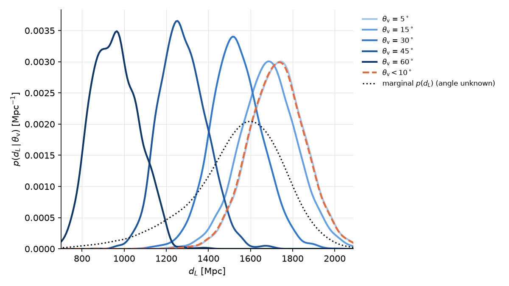

If the viewing angle were pinned down independently (an EM light curve, or by assumption),
the distance to use is the joint **conditioned** on it, not the marginal $p(d)$:

| condition | $d_L$ median [90%] (Mpc) | $P(\theta_\mathrm{v} < \theta_0)$ |
| --- | --- | --- |
| $\theta_\mathrm{v} = 5^\circ$ | 1729 [1506, 1952] | 0.026 |
| $\theta_\mathrm{v} = 15^\circ$ | 1686 [1460, 1916] | 0.219 |
| $\theta_\mathrm{v} = 30^\circ$ | 1530 [1339, 1741] | 0.641 |
| $\theta_\mathrm{v} = 45^\circ$ | 1273 [1111, 1467] | 0.897 |
| $\theta_\mathrm{v} = 60^\circ$ | 953 [790, 1147] | 0.986 |
| $\theta_\mathrm{v} < 10^\circ$ | 1726 [1502, 1950] | |
| angle unknown | 1565 [1120, 1858] | |

Knowing the source is on-axis ($\theta_\mathrm{v} < 10^\circ$) moves the median distance out
by about 160 Mpc and narrows its interval. An angle deep in the tail of $p(\theta)$
($P$ close to 0 or 1) is conditioned on few samples, so its $p(d \mid \theta_0)$ is less
smooth.

### 7.4 Check: every sampling route returns the posterior

| route | $\theta_\mathrm{v}$ q5/50/95 | $d_L$ q5/50/95 | corr$(d, \cos\theta)$ | KS($\theta$) vs PE |
| --- | --- | --- | --- | --- |
| PE samples | 6.5 / 24.4 / 51.1 | 1123 / 1566 / 1849 | 0.824 | 0 |
| 1. grid joint: $d \sim p(d)$, then $\theta \sim p(\theta \mid d)$ | 7.0 / 24.7 / 51.3 | 1122 / 1566 / 1857 | 0.820 | 0.012 |
| 2. grid $\theta \mid d_k$ at each sample's own $d$ | 7.1 / 24.6 / 51.0 | 1123 / 1566 / 1849 | 0.819 | 0.016 |
| 3. `sample_joint` (resampled PE indices) | 6.5 / 24.4 / 51.1 | 1125 / 1565 / 1847 | 0.823 | 0.002 |

Route 2 is what `sim_3d` does when its $d_i$ follow the same $p(d)$. The small shift of the
lowest angles (6.5° → 7.0°) is the KDE smoothing near the face-on edge. Route 3 involves no
density estimate at all.

---

## 8. The alert skymap and the PE disagree on distance

`sim_3d` draws $d_i$ from the **alert skymap** (Steps 4.1–4.2). Each HEALPix pixel carries
the Singer et al. (2016) conditional distance ansatz

$$
p(d \mid \mathrm{pixel}) = N_\mathrm{pix}\,d^2\,\frac{1}{\sqrt{2\pi}\,\sigma_\mathrm{pix}}
\exp\left[-\frac{(d - \mu_\mathrm{pix})^2}{2\sigma_\mathrm{pix}^2}\right],
$$

(`DISTNORM`, `DISTMU`, `DISTSIGMA`). Combining these distances with the **PE** conditional
produces

$$
p_\mathrm{route}(\theta) = \int p_\mathrm{sky}(d)\;p_\mathrm{PE}(\theta \mid d)\;dd
\ \neq\ p_\mathrm{PE}(\theta)\quad\text{unless}\quad p_\mathrm{sky}(d) = p_\mathrm{PE}(d).
$$

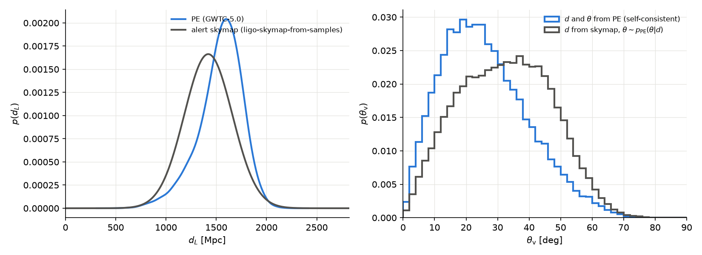

For S240615dg the alert skymap (built from the online PE, `ligo-skymap-from-samples`)
places the source at **1421 [1028, 1815] Mpc**, nearer than the final GWTC-5.0 PE
(1566 [1123, 1849] Mpc). Through the degeneracy, nearer distances mean more inclined angles.
The skymap route draws a $\theta_\mathrm{v}$ median of **32.6°** instead of 24.4°, a
**+8.2° bias**, even though almost none of the skymap draws (0.01%) fall outside the PE
distance support.

**Recommendation:** when an alert has released PE, draw sky position, distance and angle
**together** from the PE samples (`sample_joint`, the guidelines' "best option"). This
replaces Steps 4.1–4.3. Use $p(\theta \mid d_i)$ with skymap distances only when the two
distance posteriors agree. The notebook prints this recommendation whenever the shift
exceeds 2°.

---

## 9. Without PE: population and placeholder options

A public low-latency skymap carries no inclination information. The options:

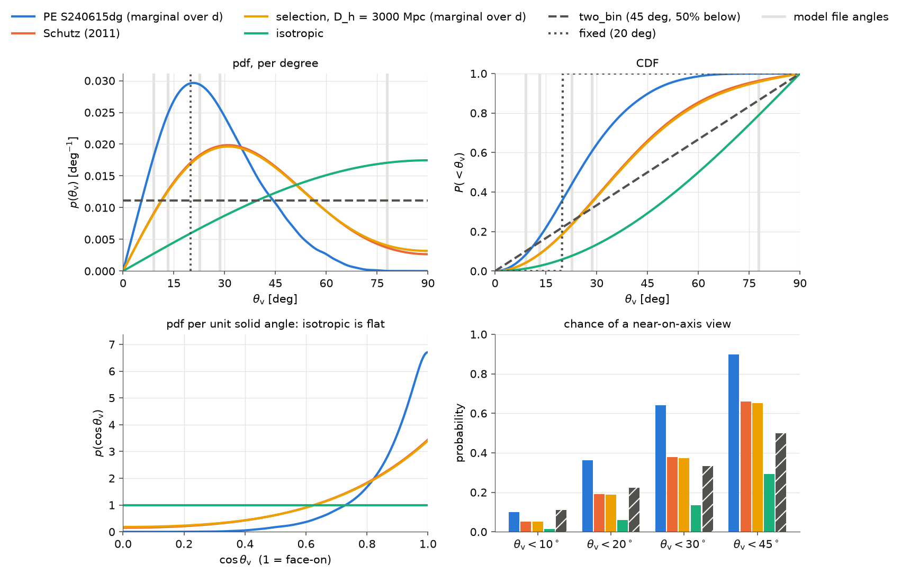

The four panels show the pdf per degree, the CDF, the pdf per unit $\cos\theta_\mathrm{v}$
(where isotropic is flat and the face-on preference of GW selection is obvious), and the
probability of a near-on-axis view. The gray bands mark the model file angles. (The first
version of this figure drew the isotropic curve as a raw, unnormalised $\sin\theta$,
peaking at 1 instead of $\pi/180$, which made it look about 57× larger than the others.)

### 9.1 Isotropic

$p(\theta) = (\pi/180)\sin\theta$: orientations with no GW selection at all. This is the
most pessimistic choice for an on-axis counterpart: median 60°, $P(\theta < 20^\circ) = 6\%$.

### 9.2 GW selection: the "selection" model and where Schutz comes from

Detected sources are not isotropic: face-on binaries are louder, so they are detectable
further away. Take sources uniform in volume ($\propto d^2$) and isotropic in orientation.
A source at $(d, \theta)$ is detected if its orientation factor exceeds the distance in
horizon units, $\Theta/4 > d/D_h$ (Section 3). Averaging over sky position and polarisation
(the antenna patterns of one L-shaped detector with isotropic $\hat n$ and uniform $\psi$)
gives the detection probability $P_\mathrm{det}(d/D_h, \theta) = P(\Theta/4 > d/D_h)$ and
the joint of the detected population:

$$
p(d, \theta) \propto d^2\,\sin\theta\;P_\mathrm{det}\!\left(\frac{d}{D_h}, \theta\right),
\qquad 0 < d < D_h .
$$

Its $d$-marginal follows from $\int_0^{D_h} d^2\,P(\Theta/4 > d/D_h)\,dd = \tfrac{1}{3}D_h^3\,\langle(\Theta/4)^3\rangle$:

$$
p(\theta) \propto \sin\theta\,\left\langle(\Theta/4)^3\right\rangle_{\hat n,\psi}.
$$

Schutz (2011) replaces $\langle\Theta^3\rangle$ by $\langle\Theta^2\rangle^{3/2}$. With
$\langle F_+^2\rangle = \langle F_\times^2\rangle = 1/5$ this gives the closed form used by
the guidelines:

$$
p_\mathrm{Schutz}(\theta) \propto \sin\theta\,\left[\frac{(1 + \cos^2\theta)^2}{4} + \cos^2\theta\right]^{3/2}.
$$

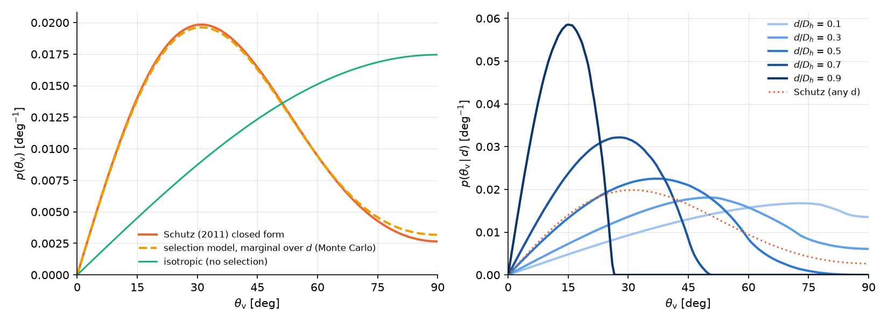

**Check:** the Monte Carlo $d$-marginal of the selection model and the Schutz closed form
have medians 36.5° and 36.2°, the same peak (31.0°), and a maximum CDF difference of 0.009.
Schutz is an excellent approximation of the selection marginal.

What Schutz throws away is the distance dependence (right panel). Nearby sources can be at
any angle; sources near the horizon are detected only if nearly face-on:

| $d / D_h$ | 0.1 | 0.3 | 0.5 | 0.7 | 0.9 |
| --- | --- | --- | --- | --- | --- |
| median $\theta_\mathrm{v}$ | 58.2° | 47.7° | 35.8° | 25.8° | 14.2° |
| $P(\theta_\mathrm{v} < 20^\circ)$ | 0.064 | 0.097 | 0.179 | 0.321 | 0.825 |

This is the population-level version of the degeneracy that the PE shows for one event. The
`"selection"` kind makes $p(\theta \mid d_i)$ available for a low-latency alert. The price is
a horizon $D_h$ for the source type and the detector network at the time of the event,
which the alert does not provide. `HORIZON_MPC = 3000` in the notebook is illustrative only.
$p(\theta \mid d)$ depends only on $d/D_h$, not on the distance prior.

### 9.3 Placeholders

- **`fixed`**: $\theta_i = \theta_0$ in every iteration (a delta function).
- **`two_bin`**: mass $p_<$ uniform on $[0, \theta_t)$ and $1 - p_<$ uniform on
  $[\theta_t, 90^\circ]$ (default $45^\circ$, 50%). This makes no claim about the shape.

### 9.4 Summary of the options

| option | median | mean | $P(<10^\circ)$ | $P(<20^\circ)$ | $P(<30^\circ)$ |
| --- | --- | --- | --- | --- | --- |
| PE S240615dg (marginal over $d$) | 24.7 | 26.4 | 0.101 | 0.362 | 0.641 |
| Schutz (2011) | 36.2 | 38.2 | 0.051 | 0.190 | 0.378 |
| selection, $D_h = 3000$ Mpc (marginal) | 36.5 | 38.7 | 0.051 | 0.188 | 0.374 |
| isotropic | 60.0 | 57.3 | 0.015 | 0.060 | 0.134 |
| two_bin (45°, 50%) | 45.0 | 45.0 | 0.111 | 0.222 | 0.333 |
| fixed (20°) | 20.0 | 20.0 | 0 | 0 | 1 |

**Check: the samplers.** 200k draws from each option against its own tabulated pdf give
KS distances at the $1/\sqrt{n} = 0.0022$ noise level, so `sample` draws what `pdf_grid`
says:

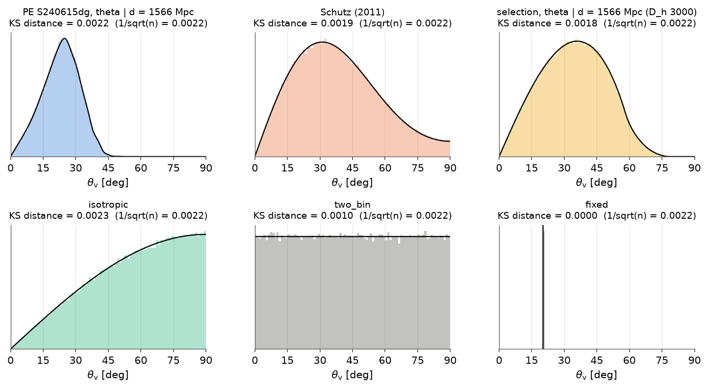

---

## 10. Where the choice reaches the upper limit

`sim_3d` has model files only at a few angles, and each drawn $\theta_i$ is mapped to one of
them (`GRBModelSet.get_model`, Step 5). With sorted file angles $\theta_1 < \dots < \theta_K$,
the fraction of iterations that use file $k$ is:

- **nearest** (Option A): the mass of $p(\theta)$ closest to $\theta_k$,
  $w_k = \int_{m_{k-1}}^{m_k} p(\theta)\,d\theta$, where the $m_k$ are the midpoints between
  file angles (0° and 90° at the ends);
- **stochastic** (Option B): each $\theta$ is split linearly between its two bracketing
  files, so $w_k = \int p(\theta)\,\Lambda_k(\theta)\,d\theta$ with $\Lambda_k$ the hat
  function peaking at $\theta_k$. Outside the tabulated range, everything goes to the edge
  file.

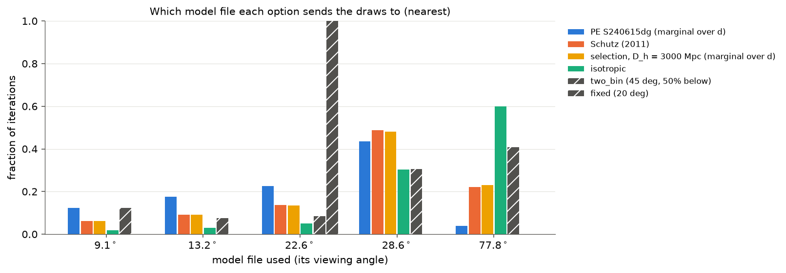

Fraction of iterations per model file (nearest):

| option | 9.1° | 13.2° | 22.6° | 28.6° | 77.8° |
| --- | --- | --- | --- | --- | --- |
| PE S240615dg | 0.124 | 0.176 | 0.225 | 0.435 | **0.040** |
| Schutz | 0.063 | 0.092 | 0.137 | 0.487 | **0.221** |
| selection ($D_h = 3000$) | 0.062 | 0.091 | 0.135 | 0.482 | 0.230 |
| isotropic | 0.019 | 0.030 | 0.050 | 0.303 | **0.599** |
| two_bin | 0.124 | 0.075 | 0.086 | 0.307 | 0.409 |
| fixed (20°) | 0 | 0 | 1 | 0 | 0 |

Stochastic (Option B):

| option | 9.1° | 13.2° | 22.6° | 28.6° | 77.8° |
| --- | --- | --- | --- | --- | --- |
| PE S240615dg | 0.125 | 0.177 | 0.222 | 0.384 | 0.092 |
| Schutz | 0.063 | 0.094 | 0.135 | 0.442 | 0.265 |
| selection ($D_h = 3000$) | 0.063 | 0.093 | 0.134 | 0.439 | 0.272 |
| isotropic | 0.019 | 0.030 | 0.049 | 0.321 | 0.581 |
| two_bin | 0.124 | 0.075 | 0.085 | 0.307 | 0.409 |
| fixed (20°) | 0 | 0.278 | 0.722 | 0 | 0 |

The far off-axis file (77.8°), where the afterglow is much fainter and later, receives 60%
of the iterations under the isotropic prior, 22% under Schutz, and 4% (nearest) under this
event's PE. The gap between the 28.6° and 77.8° files is large. Everything between about 53°
and 90° lands on the 77.8° file with the nearest method. With the stochastic method, angles
in that gap mix the two files. A model file at an intermediate angle (around 45–60°) would
reduce this sensitivity.

---

## 11. How `sim_3d` uses the result

```python
from gwuls import angle_distribution as angdist, paths

theta_dist = angdist.load_theta_distribution(paths.theta_distribution_path(source_name))

# Steps 4.1-4.2 draw d_i from the alert skymap (all N iterations at once):
theta_i = theta_dist.sample(N, distance_Mpc=d_draws, rng=rng)   # p(theta | d_i), one per d_i
# distance_Mpc is required for kind "pe" / "selection" and ignored for the others.

# With PE, the guidelines' best option replaces Steps 4.1-4.3 (see Section 8):
draw = theta_dist.sample_joint(N, rng=rng)   # ra_deg, dec_deg, distance_Mpc, theta_deg of one PE sample

# "The angle is known": the distance distribution for it, from the same joint
d, p_d = theta_dist.joint.conditional_distance(theta_deg=20.0)   # or theta_range=(0, 10)
```

A new alert with released PE: put its `*-combined_PEDataRelease.hdf5` (and the catalog's
`*-PESummaryTable.hdf5`) in `data/gw_pe/raw/`, set `source_name` to the superevent ID, and
run the notebook. Part 0 standardizes the file and updates `index.csv`. Commit
`data/gw_pe/standardized/`.

---

## 12. Caveats and open points

- **Jet along $\vec J$.** The fold assumes the jet is launched along the remnant spin,
  aligned with the binary's total angular momentum. This is standard for BNS/NSBH, but it is
  an assumption.
- **Source class.** S240615dg is a BBH, used here as a worked example. For a real
  counterpart search, the PE of a BNS or NSBH would enter the same way.
- **KDE tails.** Conditionals at angles or distances deep in the tails rest on few samples.
  The notebook flags $P(\theta < \theta_0)$ next to every $p(d \mid \theta_0)$. Distances
  outside the support are clamped and counted.
- **Skymap vs PE distance.** Mixing the two biases the angle (Section 8). Prefer
  `sample_joint` for alerts with PE.
- **Selection model.** It uses a single-detector antenna pattern averaged over sky and
  polarisation, and a sharp SNR threshold. It needs a horizon $D_h$ appropriate to the source
  type and network. 3000 Mpc is illustrative. Its marginal agrees with Schutz to within 0.009
  in CDF.
- **Model file coverage.** No file lies between 28.6° and 77.8°, so the treatment of that
  gap (nearest vs stochastic vs interpolation) matters for the prior-driven options
  (Section 10).
- **Not yet wired into `sim_3d`.** The loader and the three calls above are ready; the
  numerical-model version of `sim_3d` still has to call them.

---

## 13. References

- L. S. Finn and D. F. Chernoff, *Observing binary inspiral in gravitational radiation: one
  interferometer*, Phys. Rev. D **47**, 2198 (1993): the orientation factor $\Theta$.
- B. F. Schutz, *Networks of gravitational wave detectors and three figures of merit*, Class.
  Quantum Grav. **28**, 125023 (2011): the detected-source inclination distribution.
- L. P. Singer et al., *Going the distance: mapping host galaxies of LIGO and Virgo sources
  in three dimensions using local cosmography and targeted follow-up*, ApJL **829**, L15
  (2016): the per-pixel distance ansatz of the skymaps.
- D. W. Scott, *Multivariate Density Estimation* (Wiley, 1992): the bandwidth rule.
- LVK, GWTC-5.0 parameter-estimation data release (Zenodo): the `combined_PEDataRelease` and
  `PESummaryTable` files.
